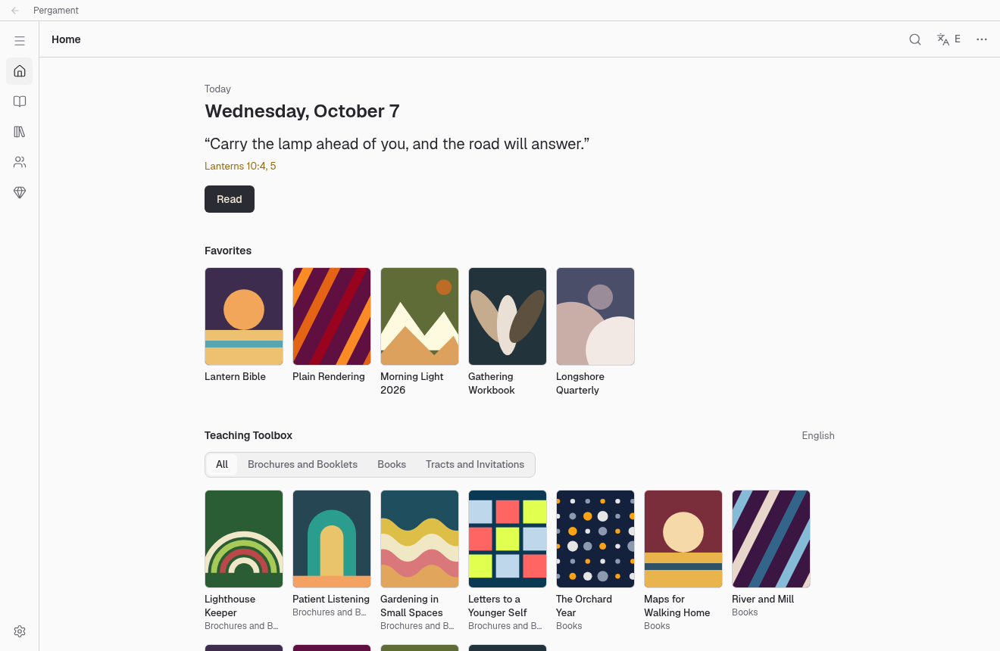
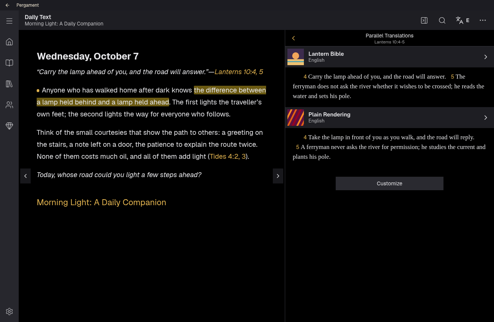
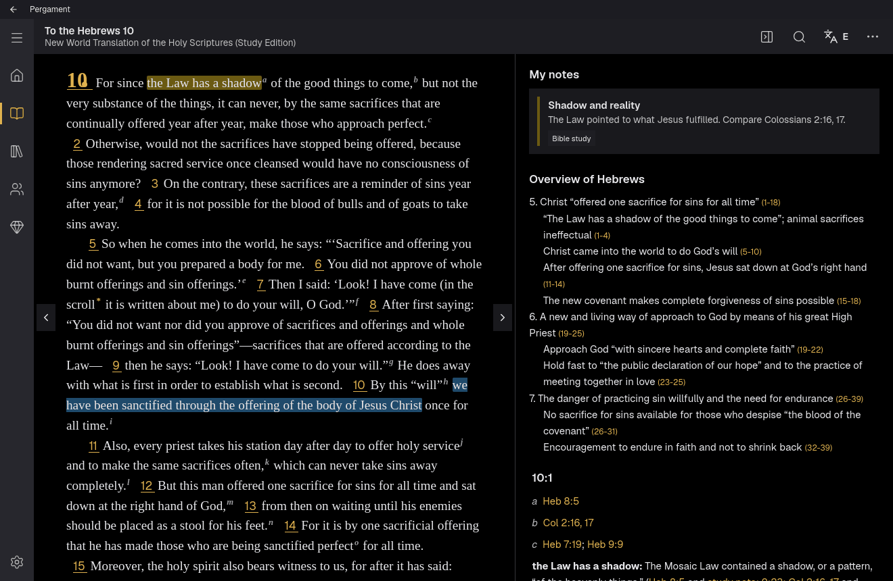
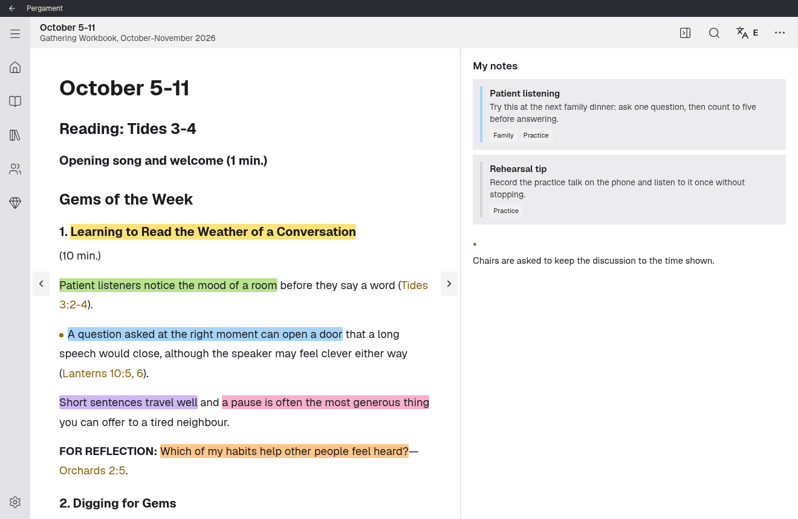
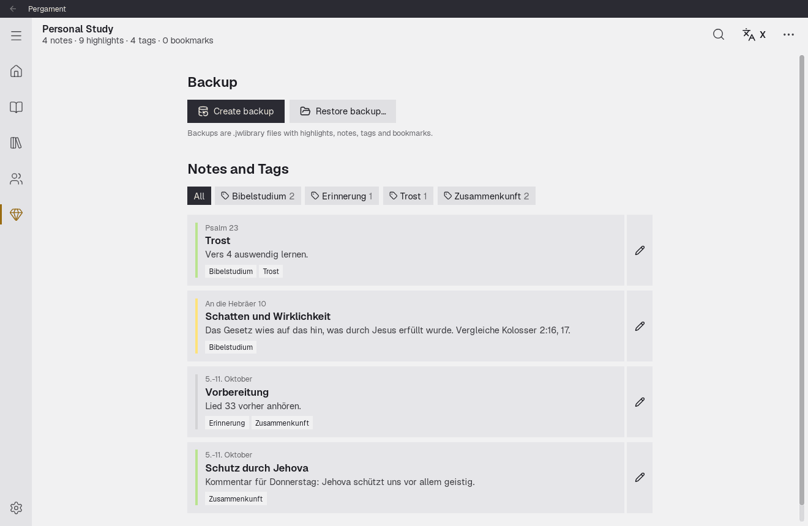

# Pergament

Pergament is an unofficial Linux reader for publications in the `.jwpub`
format. It has a desktop app (Tauri, with a React frontend), a command line
tool called `pergament`, and a Rust library underneath both. The app's layout
follows JW Library on other platforms, with its own name, colours and icons.



| | |
|---|---|
|  |  |
|  |  |

Every view is in [docs/screenshots](docs/screenshots), in both themes. The
screenshots show invented content only: made-up publications, Bible text,
covers, notes and highlights. None of it comes from a real publication.

## Before you use it

This project is not affiliated with, endorsed by or supported by Jehovah's
Witnesses or the Watch Tower Bible and Tract Society. "JW Library" and
related names are their trademarks.

- **Your own publications.** It is meant for reading publications you have
  obtained yourself, on your own computer. The repository contains no
  publications; you import or download them at runtime. Test files are read
  from paths you supply and are never committed.
- **Clean-room format.** Nothing was decompiled or taken from the official
  app. The file format was worked out from public open-source projects and
  from inspecting `.jwpub` files and one user data backup. Every detail and
  where it came from is in [docs/FORMAT.md](docs/FORMAT.md).
- **Encryption.** Publication text inside `.jwpub` files is encrypted, and
  Pergament decrypts it so you can read it. Depending on where you live,
  distributing software that does this may be restricted. Read the
  [license notes](#license) before you use or share it.
- **Free and non-commercial**, and it will stay that way. It only downloads
  files that jw.org offers for download, such as `.jwpub` publications and MP3
  and MP4 recordings, from the same public services the site uses. It does not
  scrape pages, and it is not meant for commercial use.
- **No telemetry.** The only network traffic goes to jw.org's public catalog
  and download services, and only when you search, download or play a
  recording, or when the startup check for updates refreshes a catalog you
  have loaded before.
- **Untrusted input.** Imported files are treated as untrusted: hashes are
  verified, archives are unpacked with path and size checks, and rendered HTML
  is sanitized.

## Install

Pergament is released as a zip for Linux, or you build it from source.

**From the release zip.** Download `pergament-X.Y.Z-linux-x86_64.zip` and its
`.sha256` file from the [releases page](https://github.com/v3rm1n0/pergament/releases),
then:

```sh
sha256sum -c pergament-X.Y.Z-linux-x86_64.zip.sha256
unzip pergament-X.Y.Z-linux-x86_64.zip
cd pergament-X.Y.Z-linux-x86_64
./install.sh                    # --prefix DIR, --dry-run and --uninstall also work
```

The installer copies `pergament-app` and `pergament` to `~/.local/bin`, adds
the icons and a desktop entry so Pergament shows up in your application menu,
and checks that the libraries it needs (WebKitGTK 4.1, GTK 3, libsoup 3,
OpenSSL, SQLite) are installed. The zip is built on Ubuntu 22.04, so it needs
a distribution at least that recent.

Playing videos needs GStreamer with an H.264 decoder (`gst-libav` on Debian
and Ubuntu, `gstreamer1-libav` on Fedora, `gst-libav` on Arch). Without it the
player offers to open the recording in your browser instead.

**With Nix** (flakes enabled), straight from GitHub:

```sh
nix profile install github:v3rm1n0/pergament   # installs pergament-app and pergament
nix run github:v3rm1n0/pergament               # or just try the app once
```

**With the install script**, which uses Nix if you have it and otherwise
builds with cargo and bun and installs below `~/.local`:

```sh
git clone https://github.com/v3rm1n0/pergament.git
cd pergament
scripts/install.sh              # --prefix DIR, --no-nix, --dry-run and --uninstall also work
```

Without Nix it needs cargo, bun, pkg-config and the development files for
WebKitGTK 4.1, GTK 3, libsoup 3, OpenSSL and SQLite; the script lists what is
missing for Debian, Fedora and Arch. It also runs straight from the web
(`curl -fsSL https://raw.githubusercontent.com/v3rm1n0/pergament/main/scripts/install.sh | bash`).

> **Always check scripts you copy from the internet.** Piping a download into
> `bash` runs whatever it contains, with your permissions. Read
> [scripts/install.sh](scripts/install.sh) first, or clone the repository and
> run it from the checkout. It builds from source and only writes below the
> prefix (`~/.local` by default) or into your Nix profile; `--dry-run` prints
> every step without doing it.

## Desktop app

- **Home:** today's date and theme scripture when the daily text booklet is
  downloaded, a Daily Text view with arrows for the previous and next day, and
  below it your favorites, the Teaching Toolbox and What's New.
- **Bible:** tabs from the publication's own navigation, book tiles and a
  chapter grid. The reader has a study pane with the outline, footnotes, cross
  references and study notes per verse.
- **Library:** the catalog's categories, split the way JW Library does it
  (newer and older publications, yearbooks, editions, Watchtower and Awake! by
  year). Downloaded publications are grouped by the type in their manifest, so
  types the catalog doesn't list, such as Curriculum and Outlines, show up once
  you import one.
- **Tile menu:** the three dots on a tile share a jw.org link, add it to your
  favorites (also if it isn't downloaded), offer it in other languages and
  remove a downloaded publication.
- **Video and audio:** the public categories are in the Library. A click on a
  thumbnail streams the recording in a dialog that uses the system's own media
  controls, with quality (automatic unless you choose one), speed, repeat and
  subtitles. The player sits next to the sidebar and can be minimized to a bar
  while you keep reading. The cloud button downloads a quality you pick;
  downloads are verified, kept in the library folder and listed under
  Downloaded. Recordings that publications link to open in the same dialog,
  and a picture in a publication opens large, with zoom and its caption.
- **Updates:** a Library tab lists downloaded publications that have a newer
  version in the catalog, with "Update all". Updating replaces the old version;
  highlights, notes and bookmarks are kept because they are stored apart from
  the publications. At startup the app compares your publications with the
  catalog, but only if you have loaded it before, at most once a day, and
  Settings can turn it off.
- **Meetings:** the selected week's workbook program and Watchtower study
  article from downloaded issues, with links to download the rest.
- **Links:** a Bible link opens "Parallel Translations" in a side pane, the
  cited verses in every Bible of your library ("Customize" chooses which and in
  what order). Other links open the reference with the cited paragraphs tinted;
  the bar at the top of the pane opens it in the main reader, and the pane
  offers to download a publication you don't have.
- **Study:** select text to highlight it in one of six colours or attach a
  note, and click a highlight to change or remove it. Answer fields in
  workbooks and study articles are text boxes whose content stays on this
  computer. Personal Study lists your notes with their tags, and your
  bookmarks.
- **Backups** are `.jwlibrary` files, the same format JW Library uses, so a
  backup from a phone can be restored here and the other way round. Restoring
  replaces the current data; the previous database is kept as
  `userData.db.before-restore` in the library folder.
- **Second display:** a Settings option opens a black window, fullscreen on
  another monitor if there is one, that shows the year text from the daily
  text booklet. Recordings and pictures you open are shown there too, without
  controls, and the player here becomes the remote control. Wayland
  compositors decide on which screen a window appears; if it opens on the
  wrong one, move it and press F for fullscreen.

The publication language menu sits in the top right corner. The interface is
available in English and German (Settings; by default it follows the system
language) with a light and a dark theme. To add a language, see
[docs/TRANSLATING.md](docs/TRANSLATING.md).

Home lists, categories and meetings come from jw.org's public catalog, about
58 MB. It is downloaded only when you ask for it and checked for updates at
most once a day. Cover images are fetched once and cached.

On Linux the app sets two environment variables unless you have set them:
`WEBKIT_DISABLE_DMABUF_RENDERER=1`, because WebKitGTK draws garbage on some
GPUs without it, and `GST_PLUGIN_FEATURE_RANK`, so GStreamer does not pick
NVIDIA's hardware video decoders, which take the page down on NVIDIA under
Wayland. Software decoding handles these videos fine.

## Command line

```sh
pergament import nwtsty_X.jwpub wp_X_202609.jwpub   # verify and add to the library
pergament list                                      # show imported publications
pergament show nwtsty                               # list books and documents
pergament show nwtsty 19:23 > psalm23.html          # Bible chapter (book:chapter)
pergament show wp26 3 > article.html                # document by DocumentId
pergament search X wachtturm                        # search the catalog (X = German)
pergament download wp --lang X --issue 20260900     # download, verify, import
pergament download nwtsty --lang X                  # undated works need no issue
```

- `show` writes a complete HTML page with light and dark styles, with images
  pointing into the library. `--fragment` prints only the content.
- Language codes are mapped to MEPS ids through the catalog; for a language
  that can't be mapped, pass `--meps-id`.
- Downloads resume after an interruption. They are checked against the MD5
  from the download API and, when the catalog is cached, against its size and
  SHA-1, and then go through the normal import. Requests carry a
  `pergament/…` User-Agent, are at least one second apart and are retried
  with backoff on network errors, 429 and 5xx.
- The library lives in `$XDG_DATA_HOME/pergament` (usually
  `~/.local/share/pergament`); `--library DIR` or `PERGAMENT_LIBRARY` changes
  it. The catalog and partial downloads go to `$XDG_CACHE_HOME/pergament`
  (`--cache DIR` or `PERGAMENT_CACHE`). A folder from before the rename,
  `jwlinux`, is moved to the new name on first start. Importing a publication
  again replaces the existing copy.

## Contributing

Pull requests are welcome, and so are translations. How to run it from source,
the checks, and how releases are made are in [CONTRIBUTING.md](CONTRIBUTING.md).

## License

This project is free software under the GNU General Public License,
version 3 only. The full text is in [LICENSE](LICENSE). The notes below
describe how the project is published and what you should know before using
it. They do not add restrictions to the GPL.

**Tolerated, not authorised.** The project has no permission from the Watch
Tower Bible and Tract Society or any other rights holder of the publications
it reads. At most, its existence and use are tolerated. That can change at any
time, and the project may then be changed or withdrawn without notice.

**Use at your own risk.** You use this software entirely at your own risk. As
sections 15 and 16 of the GPL state, it comes without any warranty, and the
authors are not liable for any damage or loss, including lost data and any
legal consequences of using it. You are responsible for checking that your use
is lawful where you live, in particular decrypting `.jwpub` files and
downloading from jw.org.

**Official builds.** Each release on GitHub has a zip with the compiled
binaries, the icons and an install script, a `.sha256` file to check the zip,
and the source code. These are the only official builds; there are no
distribution packages. You can also build it yourself as described under
[Install](#install). Compiled versions from anyone else do not come from this
project and are not supported.
